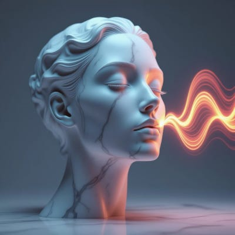
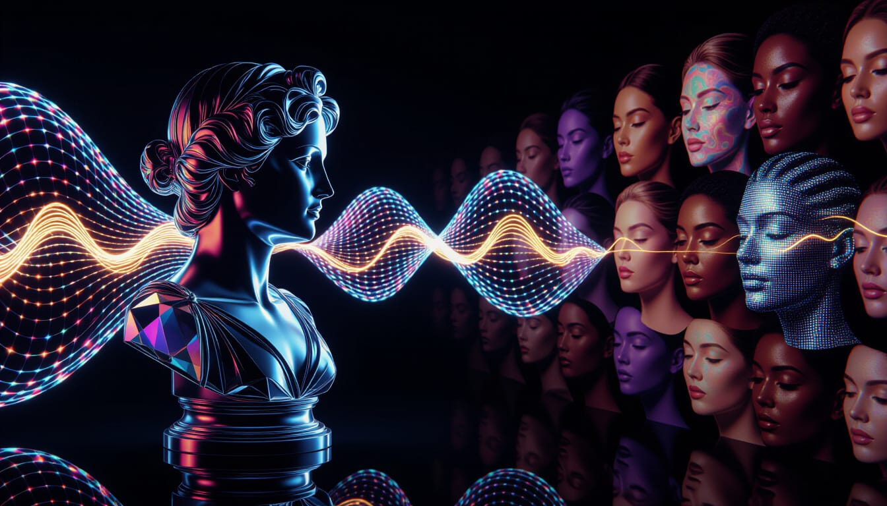
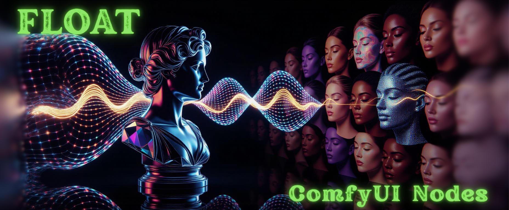

# Audio Separation assets

## Icon


prompt:

```
logo design, a photorealistic digital portrait of an androgynous face with a calm, neutral expression,
made of polished marble. From the right side, a vibrant, glowing waveform of liquid light,
representing an audio signal, flows into the mouth and ear.
Where the light touches the marble face, it dissolves into intricate, fluid patterns of sound waves,
showing a seamless transformation from static to dynamic. The background is a minimalist dark gray,
studio lighting, cinematic, ultra high detail. --ar 1:1
```

Model: HiDream I1

Version used:




## Banner



prompt:

```
stunning macro shot of an intricate faceted crystal bust of a person, positioned on the left side of the frame against
a pitch black background.
A shimmering iridescent audio waveform, like a wave of energy, enters from the left and refracts through the crystal.
As the light passes through, it projects a beautiful, vivid sequence of emotional, expressive faces onto the dark
background, stretching across the frame to the right.
A subtle thread of golden light separates from the main wave and illuminates the crystal's core.
Volumetric light, god rays creating caustics, cinematic, unbelievably beautiful. --ar 21:9
```

Model: HiDream I1

Version used:


