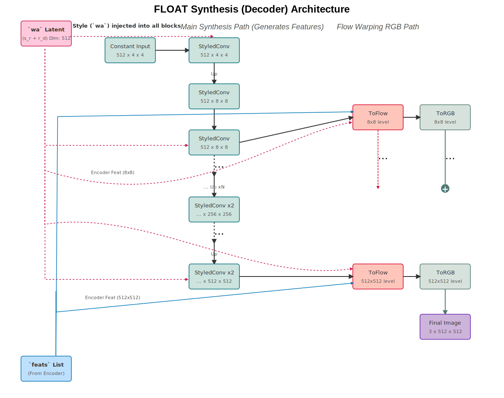

### `Synthesis` Architecture Breakdown

The `Synthesis` module is essentially the expanding path of a U-Net, but with some very specific block types. It takes the latent `wa` and the `feats` list (skip connections from the encoder) and generates an image. Let's assume `size=512`.

1.  **Input Processing:**
    *   It takes a latent vector `wa` (shape `(B, 512)`), which is the result of `s_r + r_d` for a given frame.
    *   This `wa` is expanded into a `latent` tensor of shape `(B, n_latent, 512)` to be fed as the `style` input to the various `StyledConv` layers. `n_latent` is `(log_size * 2 - 2)`.

2.  **Synthesis Path (Main "Up" Path):**
    *   Starts with a `ConstantInput` of shape `(B, 512, 4, 4)`.
    *   Goes through a `StyledConv` layer (`conv1`).
    *   Then, it enters a loop that iterates from `size=8` up to `size=512`. In each iteration, it performs two `StyledConv` operations (one with upsampling).

3.  **Flow Warping and Skip Connections:**
    *   This is the most unique part. In parallel with the main synthesis path, it has `ToFlow` and `ToRGB` branches.
    *   At each resolution level (starting from 8x8), a `ToFlow` block takes the current feature map `out` from the main path and a corresponding `feat` tensor (a skip connection) from the `EncoderApp`.
    *   `ToFlow` uses `out` and `wa` (as style) to predict a 2D flow field and a mask.
    *   It **warps** the `feat` tensor using this flow field.
    *   It combines the warped feature map with `out` and a skip connection from the *previous* `ToFlow` block's flow output.
    *   A `ToRGB` block converts the output of `ToFlow` into an RGB image snippet at the current resolution.
    *   This RGB snippet is upsampled and added to the output of the next `ToRGB` block, progressively refining the final image.

The diagram will show these two parallel pathways: the main synthesis path generating features, and the flow/RGB path taking those features, warping the encoder's skip connections, and creating the final image.

**How to Interpret the SVG:**

1.  **Inputs (Left Side):**
    *   The pink **`wa` Latent** is the primary style/motion input for the current frame.
    *   The blue **`feats` List** represents the skip connections coming from the Encoder.

2.  **Main Synthesis Path (Center Column):**
    *   This shows the "backbone" of the generator, starting with a `Constant Input` and progressively upsampling with `StyledConv` blocks (light teal).
    *   The output of this path at each resolution is a feature map that will be used by the `ToFlow` block. I've shown connections from this path to the Flow path.

3.  **Flow Warping & RGB Path (Right Column):**
    *   This shows the parallel path that actually generates the image.
    *   **`ToFlow` blocks (pinkish-red):** These receive features from the Main Synthesis Path (black arrows) and also from the Encoder's `feats` list (light blue skip-connection arrows).
    *   **`ToRGB` blocks (gray-green):** These take the output of `ToFlow` and convert it into a low-resolution RGB image.
    *   **Progressive Refinement:** The RGB output from one level is upsampled and added (`+` circle) to the RGB output of the next level, gradually building the final high-resolution image.

4.  **Arrows:**
    *   **Black (Solid):** Main data flow within a path.
    *   **Red (Dashed):** Shows the `wa` latent being injected as a "style" into *all* `StyledConv` and `ToFlow` blocks.
    *   **Light Blue (Solid Curve):** Skip connections (`feats`) coming from the encoder into the `ToFlow` blocks.
    *   **Reddish (Dashed Curve):** Represents the flow information being passed between `ToFlow` blocks.
    *   **Green (Solid):** The final RGB image generation path.

This diagram visualizes the key concepts: a main synthesis "spine", skip connections from the encoder, style-based modulation at every step, and a separate path that uses flow-warping to combine these elements into the final image.
