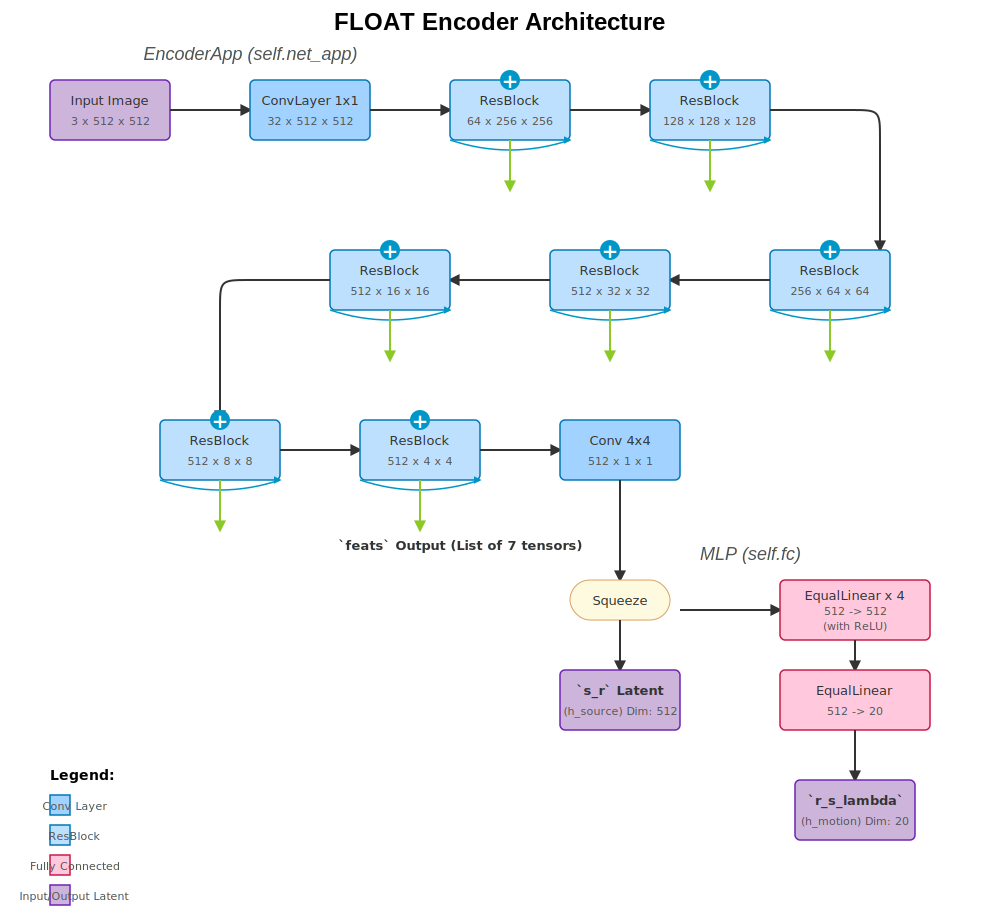

### `Encoder` Architecture Breakdown

The `Encoder` module consists of two main parts: `self.net_app` (an `EncoderApp`) and `self.fc` (an `nn.Sequential` of `EqualLinear` layers).

**1. `EncoderApp` (`self.net_app`):** This is a downscaling convolutional network. Assuming `size=512`, `w_dim=512`.

| Layer No. (in `convs`) | Operation | Input Shape (C, H, W) | Output Shape (C, H, W) | Notes |
| :--- | :--- | :--- | :--- | :--- |
| `convs.0` | `ConvLayer` | `(3, 512, 512)` | `(32, 512, 512)` | From `CHANNELS_MAP[512]`. Kernel `1x1`. |
| `convs.1` | `ResBlock` | `(32, 512, 512)` | `(64, 256, 256)` | Downsamples. `CHANNELS_MAP[256]`. |
| `convs.2` | `ResBlock` | `(64, 256, 256)` | `(128, 128, 128)` | Downsamples. `CHANNELS_MAP[128]`. |
| `convs.3` | `ResBlock` | `(128, 128, 128)` | `(256, 64, 64)` | Downsamples. `CHANNELS_MAP[64]`. |
| `convs.4` | `ResBlock` | `(256, 64, 64)` | `(512, 32, 32)` | Downsamples. `CHANNELS_MAP[32]`. |
| `convs.5` | `ResBlock` | `(512, 32, 32)` | `(512, 16, 16)` | Downsamples. `CHANNELS_MAP[16]`. |
| `convs.6` | `ResBlock` | `(512, 16, 16)` | `(512, 8, 8)` | Downsamples. `CHANNELS_MAP[8]`. |
| `convs.7` | `ResBlock` | `(512, 8, 8)` | `(512, 4, 4)` | Downsamples. `CHANNELS_MAP[4]`. |
| `convs.8` | `EqualConv2d`| `(512, 4, 4)` | `(512, 1, 1)` | Kernel `4x4`. Final feature map. |

The `forward` pass of `EncoderApp` also returns `feats`, which are the intermediate feature maps. These will be shown as outputs branching off the main path.

**2. Flatten and `self.fc`:**

*   The `(512, 1, 1)` output of `EncoderApp` is squeezed to a vector of shape `(512,)`. This is `h_source` or `s_r`.
*   This vector is then passed through `self.fc`, which is a sequence of `EqualLinear` layers. Assuming `dim=512` and `dim_motion=20`:

| Layer No. (in `fc`) | Operation | Input Dim | Output Dim | Notes |
| :--- | :--- | :--- | :--- | :--- |
| `fc.0` | `EqualLinear` | `512` | `512` | |
| `fc.1` | `EqualLinear` | `512` | `512` | |
| `fc.2` | `EqualLinear` | `512` | `512` | |
| `fc.3` | `EqualLinear` | `512` | `512` | |
| `fc.4` | `EqualLinear` | `512` | `20` | Output is `h_motion` or `r_s_lambda`. |

