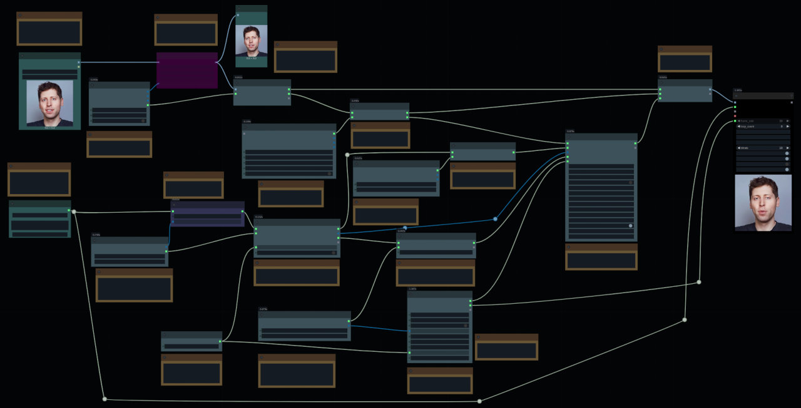

# FLOAT (Very Advanced) Nodes Reference

This document provides a reference for the "Very Advanced" (VA) nodes in the ComfyUI FLOAT Optimized integration. These nodes offer maximum granular control over the model's pipeline by breaking it down into its constituent parts: loaders for each neural network component and "apply" nodes that perform a specific computation.

This workflow is recommended for users who want to experiment with swapping out model parts (e.g., using a custom audio encoder), fine-tune every parameter, or deeply investigate the model's internal workings.

[Workflow example](https://github.com/set-soft/ComfyUI-FLOAT_Optimized/raw/refs/heads/master/example_workflows/float_very_advanced.json)

**Jump to section:**
- [Workflow Overview](#workflow-overview)
- [Loader Nodes](#loader-nodes)
  - [LoadWav2VecModel](#loadwav2vecmodel)
  - [LoadAudioProjectionLayer](#loadaudioprojectionlayer)
  - [LoadEmotionRecognitionModel](#loademotionrecognitionmodel)
  - [LoadFloatEncoderModel](#loadfloatencodermodel)
  - [LoadFloatSynthesisModel](#loadfloatsynthesismodel)
  - [LoadFMTModel](#loadfmtmodel)
- [Apply & Process Nodes](#apply--process-nodes)
  - [FloatAudioPreprocessAndFeatureExtract](#floataudioprocessandfeatureextract)
  - [FloatApplyAudioProjection](#floatapplyaudioprojection)
  - [FloatExtractEmotionWithCustomModel](#floatextractemotionwithcustommodel)
  - [FloatExtractEmotionWithCustomModelDyn](#floatextractemotionwithcustommodeldyn)
  - [ApplyFloatEncoder](#applyfloatencoder)
  - [FloatGetIdentityReferenceVA](#floatgetidentityreferenceva)
  - [ApplyFloatSynthesis](#applyfloatsynthesis)
  - [FloatSampleMotionSequenceRD_VA](#floatsamplemotionsequencerd_va)

---

## Workflow Overview

The "Very Advanced" workflow decouples the main `float_pipe` into its constituent parts. A typical graph connects these nodes in a sequence that mirrors the internal logic of the integrated FLOAT model.

**Image Path:** `LoadFloatEncoderModel` → `ApplyFloatEncoder`
**Audio Path:** `LoadWav2VecModel` → `FloatAudioPreprocessAndFeatureExtract` → `LoadAudioProjectionLayer` → `FloatApplyAudioProjection`
**Emotion Path:** `LoadEmotionRecognitionModel` → `FloatExtractEmotionWithCustomModel`/`FloatExtractEmotionWithCustomModelDyn`
**Identity Path:** `ApplyFloatEncoder` → `LoadFloatSynthesisModel` → `FloatGetIdentityReferenceVA`
**Sampling Path:** (Outputs from above paths) → `LoadFMTModel` → `FloatSampleMotionSequenceRD_VA`
**Decoding Path:** (Outputs from Image & Sampling paths) → `LoadFloatSynthesisModel` → `ApplyFloatSynthesis`

## Loader Nodes

Source: `nodes_adv_loader.py`

These nodes are responsible for loading pre-trained model components from disk into memory. They typically reside in the `FLOAT/Very Advanced/Loaders` category.

### `LoadWav2VecModel`
- **Display Name:** Load Wav2Vec Model (for Audio Encoding) (VA)
- **Description:** Loads a standard Wav2Vec2-type model and its feature extractor. The model is wrapped in the custom `FloatWav2VecModel` class, which handles internal time-domain interpolation required for generating audio content features (`wa_latent`).
- **Inputs:**
  - `model_folder`: (Dropdown) Name of the Hugging Face model folder located in `ComfyUI/models/audio/`.
  - `target_device`: (Dropdown) The device (CPU or CUDA) to which the model's weights will be assigned for computation.
- **Outputs:**
  - `sampling_rate`: (INT) The sample rate expected by the loaded model (e.g., 16000).
  - `wav2vec_pipe`: (WAV2VEC_PIPE) A pipe containing the loaded `FloatWav2VecModel` instance and its feature extractor.

### `LoadAudioProjectionLayer`
- **Display Name:** Load Audio Projection Layer (VA)
- **Description:** Loads weights for an audio projection layer from a `.safetensors` file. It infers the input and output dimensions from the weights and constructs the `nn.Sequential` layer, which is used to project Wav2Vec features into the `wa_latent` space.
- **Inputs:**
  - `projection_file`: (Dropdown) The `.safetensors` file from `ComfyUI/models/float/audio_projections/`.
  - `target_device`: (Dropdown) The device (CPU or CUDA) to which the projection layer will be assigned for computation.
- **Outputs:**
  - `projection_layer`: (AUDIO_PROJECTION_LAYER) The loaded `nn.Module`.
  - `inferred_input_dim`: (INT) The feature dimension the layer expects as input.
  - `dim_a`: (INT) The dimension of the `wa_latent` this layer will produce.

### `LoadEmotionRecognitionModel`
- **Display Name:** Load Emotion Recognition Model (VA)
- **Description:** Loads a Wav2Vec2-based Speech Emotion Recognition (SER) model. It uses the specific `Wav2Vec2ForSpeechClassification` class required by FLOAT and outputs the model pipe along with the number of emotion classes (`dim_e`) inferred from the model's configuration.
- **Inputs:**
  - `model_folder`: (Dropdown) Name of the SER model folder in `ComfyUI/models/audio/`.
  - `target_device`: (Dropdown) The device (CPU or CUDA) to which the emotion model will be assigned for computation.
- **Outputs:**
  - `emotion_model_pipe`: (EMOTION_MODEL_PIPE) A pipe containing the loaded model, its feature extractor, and config.
  - `dim_e`: (INT) The number of emotion classes this model predicts.

### `LoadFloatEncoderModel`
- **Display Name:** Load FLOAT Encoder (VA)
- **Description:** Loads the weights for the motion autoencoder's Encoder part from a `.safetensors` file. It automatically infers the model's architecture (input size, latent dimensions) from the loaded weights, preparing it for image analysis.
- **Inputs:**
  - `encoder_file`: (Dropdown) The `.safetensors` file from `ComfyUI/models/float/motion_autoencoder/`.
  - `target_device`: (Dropdown) The device where the Encoder will run.
  - `cudnn_benchmark`: (BOOLEAN) Enable or disable cuDNN benchmarking for this model's operations.
- **Outputs:**
  - `float_encoder`: (FLOAT_ENCODER_MODEL) The loaded `Encoder` module instance.
  - `inferred_input_size`: (INT) The image size (e.g., 512) the encoder was trained on.
  - `dim_w`: (INT) The dimension of the main appearance latent (`s_r`).
  - `dim_m`: (INT) The dimension of the motion control parameters (`r_s_lambda`).

### `LoadFloatSynthesisModel`
- **Display Name:** Load FLOAT Synthesis (Decoder) (VA)
- **Description:** Loads the weights for the motion autoencoder's Synthesis (Decoder) part from a `.safetensors` file. It infers key architectural parameters from the weights and takes hyperparameters like `channel_multiplier` as input to construct the image generation model.
- **Inputs:**
  - `synthesis_file`: (Dropdown) The `.safetensors` file from `ComfyUI/models/float/motion_autoencoder/`.
  - `target_device`: (Dropdown) The device where the Synthesis module will run.
  - `channel_multiplier`: (INT) Architectural hyperparameter. Must match the value used to train the loaded weights.
  - `blur_kernel_str`: (STRING) Architectural hyperparameter for upsampling layers, as a Python list string (e.g., `'[1,3,3,1]'`). Must match the trained weights.
  - `cudnn_benchmark`: (BOOLEAN) Enable or disable cuDNN benchmarking.
- **Outputs:**
  - `float_synthesis`: (FLOAT_SYNTHESIS_MODEL) The loaded `Synthesis` module instance.
  - `inferred_size`: (INT) The output image size this module generates.
  - `inferred_style_dim`: (INT) The dimension of the style/motion latents (`wa`) it expects.
  - `inferred_motion_dim`: (INT) The dimension of the directional motion parameters it uses.

### `LoadFMTModel`
- **Display Name:** Load FLOAT FMT Model (VA)
- **Description:** Loads the Flow Matching Transformer (FMT) weights. It infers the internal architecture (`dim_h`, `fmt_depth`, etc.) and requires the user to provide parameters that define the temporal structure (like `fps`, `num_prev_frames`) and attention mechanism, validating them against the loaded checkpoint.
- **Inputs:**
  - `fmt_file`: (Dropdown) The `.safetensors` file from `ComfyUI/models/float/fmt/`.
  - `target_device`: (Dropdown) The device where the FMT will run.
  - `cudnn_benchmark`: (BOOLEAN) Enable or disable cuDNN benchmarking.
  - `dim_e`: (INT) The dimension of the emotion latent (`we`). Must match the loaded emotion model.
  - `num_heads`: (INT) Architectural hyperparameter for the number of attention heads. Must match loaded weights.
  - `attention_window`: (INT) Architectural hyperparameter for the attention mask's local window size. Must match loaded weights.
  - `num_prev_frames`: (INT) Architectural hyperparameter for the number of previous frames used as context. Must match loaded weights.
  - `fps`: (FLOAT) The FPS rate used to define the model's temporal structure. Must align with the saved positional embedding.
  - `wav2vec_sec`: (FLOAT) Duration of audio processed per chunk. Must align with the saved positional embedding.
- **Outputs:**
  - `float_fmt_model`: (FLOAT_FMT_MODEL) The loaded `FlowMatchingTransformer` instance.
  - `fps`: (FLOAT) The `fps` value used to configure the model.
  - `fmt_options_out`: (ADV_FLOAT_DICT) A dictionary of all effective options used to construct the FMT model.

---

## "Apply" & Process Nodes

Source: `nodes_vadv.py`

These nodes perform computations using the models loaded by the loader nodes.

### `ApplyFloatEncoder`
- **Display Name:** Apply FLOAT Encoder (VA)
- **Description:** Applies the loaded FLOAT Encoder to a batch of reference images. It preprocesses the images and passes them through the encoder to extract the core appearance latent and multi-scale feature maps, which are bundled into a single Appearance Pipe.
- **Inputs:**
  - `ref_image`: (IMAGE) A batch of reference images, correctly sized (e.g., 512x512) for the encoder.
  - `float_encoder`: (FLOAT_ENCODER_MODEL) The loaded FLOAT Encoder model module.
- **Outputs:**
  - `appearance_pipe (Ws→r)`: (FLOAT_APPEARANCE_PIPE) A pipe containing the appearance latent (`h_source` / `s_r`) and the list of feature maps (`feats`).
  - `r_s_lambda_latent`: (TORCH_TENSOR) The motion control parameters (`h_motion`).
  - `float_encoder_out`: (FLOAT_ENCODER_MODEL) Passthrough of the input encoder.

### `FloatGetIdentityReferenceVA`
- **Display Name:** FLOAT Get Identity Reference (VA)
- **Description:** Derives the identity-specific motion reference latent (`r_s`) from the motion control parameters (`r_s_lambda`). This node uses the `direction` module within the loaded Synthesis/Decoder model to perform the transformation, creating a key conditioning signal for the FMT sampler.
- **Inputs:**
  - `r_s_lambda_latent`: (TORCH_TENSOR) The motion control parameters (`h_motion`) output by the FLOAT Encoder.
  - `float_synthesis`: (FLOAT_SYNTHESIS_MODEL) The loaded FLOAT Synthesis (Decoder) model, which contains the `direction` module needed for this transformation.
- **Outputs:**
  - `float_synthesis_out`: (FLOAT_SYNTHESIS_MODEL) Passthrough of the input synthesis model.
  - `r_s_latent (Wr→s)`: (TORCH_TENSOR) The final reference identity latent (`wr` or `r_s`).

### `FloatAudioPreprocessAndFeatureExtract`
- **Display Name:** FLOAT Audio Feature Extract (VA)
- **Description:** Processes a batch of pre-validated (mono, correct SR) audio. It applies the feature extractor from the loaded Wav2Vec pipe, runs the audio through the Wav2Vec model, and interpolates the resulting features to match the target video FPS, making them ready for projection.
- **Inputs:**
  - `audio`: (AUDIO) The raw ComfyUI audio input. Must be mono and have the correct sample rate required by the Wav2Vec pipe.
  - `wav2vec_pipe`: (WAV2VEC_PIPE) The loaded Wav2Vec pipe, containing the model, feature extractor, and options.
  - `target_fps`: (FLOAT) The target video frames-per-second. Used to calculate the final number of feature frames.
  - `only_last_features`: (BOOLEAN) If True, use only the features from the last transformer layer. If False, concatenate features from all transformer layers, resulting in a much larger feature dimension.
- **Outputs:**
  - `wav2vec_features`: (TORCH_TENSOR) The final feature tensors ready for the projection layer.
  - `audio_num_frames`: (INT) The total number of video frames corresponding to the audio length.
  - `processed_audio_features`: (TORCH_TENSOR) The audio features *after* the feature extractor (but before the main Wav2Vec model), ready to be used by the emotion model.
  - `wav2vec_pipe_out`: (WAV2VEC_PIPE) Passthrough of the input pipe.
  - `audio`: (AUDIO) Passthrough of the input audio.
  - `fps`: (FLOAT) Passthrough of the input target_fps.

### `FloatApplyAudioProjection`
- **Display Name:** FLOAT Apply Audio Projection (VA)
- **Description:** Applies the loaded audio projection layer to the features extracted from the Wav2Vec model. This final step projects the high-dimensional audio features down to the motion latent space, producing the final audio conditioning tensor (`wa_latent`).
- **Inputs:**
  - `wav2vec_features`: (TORCH_TENSOR) The batch of interpolated feature tensors from the Wav2Vec node.
  - `projection_layer`: (AUDIO_PROJECTION_LAYER) The loaded audio projection layer module.
- **Outputs:**
  - `wa_latent`: (TORCH_TENSOR) The final audio conditioning latent.

### `FloatExtractEmotionWithCustomModel`
- **Display Name:** FLOAT Extract Emotion from Features (VA)
- **Description:** Generates the emotion conditioning latent (`we`). If an emotion is specified, it creates a one-hot encoded tensor. If set to 'none', it predicts the emotion from the provided preprocessed audio features using the loaded custom emotion recognition model.
- **Inputs:**
  - `processed_audio_features`: (TORCH_TENSOR) The batch of preprocessed audio features, output by a feature extractor like the one in `FloatAudioPreprocessAndFeatureExtract`.
  - `emotion_model_pipe`: (EMOTION_MODEL_PIPE) The loaded emotion recognition model pipe.
  - `emotion`: (Dropdown) Select a specific emotion or 'none' to have the model predict the emotion from the audio features.
- **Outputs:**
  - `we_latent`: (TORCH_TENSOR) The final emotion conditioning latent.
  - `emotion_model_pipe_out`: (EMOTION_MODEL_PIPE) Passthrough of the input pipe.

### `FloatExtractEmotionWithCustomModelDyn`

- **Display Name:** FLOAT Extract Emotion (Dynamic) (VA)
- **Description:** Generates a dynamic, time-varying emotion conditioning latent (`we`). It processes the raw audio in chunks to predict an emotion for each segment. The resulting sequence of emotion vectors allows the facial expression to change over the duration of the clip, following the emotional tone of the audio.
- **Inputs:**
  - `audio`: (AUDIO) The raw ComfyUI audio input. **Note:** This node performs its own preprocessing; the audio must be mono and at the sample rate expected by the loaded emotion model.
  - `emotion_model_pipe`: (EMOTION_MODEL_PIPE) The loaded emotion recognition model pipe from the `LoadEmotionRecognitionModel` node.
  - `target_fps`: (FLOAT) The target video frames-per-second. This is used to correctly map the chunk-level emotion predictions to a final frame-level sequence.
  - `chunk_duration_sec`: (FLOAT) The duration of audio (in seconds) to analyze for each distinct emotion prediction. A smaller value (e.g., 1.0-2.0s) allows for more rapid emotional shifts.
- **Outputs:**
  - `we_latent_dynamic`: (TORCH_TENSOR) The final time-varying emotion latent, with shape `(Batch, TotalFrames, EmotionDim)`. This is ready to be used by the advanced sampler.
  - `emotion_model_pipe_out`: (EMOTION_MODEL_PIPE) Passthrough of the input emotion model pipe for chaining.

### `FloatSampleMotionSequenceRD_VA`
- **Display Name:** Sample Motion Sequence RD (VA)
- **Description:** The core sampling node. It uses the loaded Flow Matching Transformer (FMT) and an ODE solver to generate the driven motion latent sequence (`r_d`). It takes all conditioning latents (`r_s`, `wa`, `we`) and provides explicit user control over CFG scales, ODE parameters, and noise generation.
- **Inputs:**
  - **`float_fmt_model`** (FLOAT\_FMT\_MODEL): The loaded `FlowMatchingTransformer` model module from a loader node.
  - **`r_s_latent`** (TORCH\_TENSOR): The reference identity latent (`wr`), derived from the source image. This provides the static identity/style conditioning.
  - **`wa_latent`** (TORCH\_TENSOR): The audio conditioning latent (`wa`), derived from the audio features and projection. This drives the primary motion.
  - **`we_latent`** (TORCH\_TENSOR): The emotion conditioning latent (`we`), derived from emotion prediction or specification.
  - **`audio_num_frames`** (INT, *Link Only*): Total number of frames to generate, determined by the audio length and target FPS. Must be connected from an upstream node.
  - **`a_cfg_scale`** (FLOAT): **Audio Guidance Scale.** Higher values (e.g., > 1.0) make the motion follow the audio more strictly.
  - **`r_cfg_scale`** (FLOAT): **Reference Identity Guidance Scale.** Controls adherence to the identity. Requires `include_r_cfg` to be enabled.
  - **`e_cfg_scale`** (FLOAT): **Emotion Guidance Scale.** Higher values make the motion express the target emotion more strongly.
  - **`include_r_cfg`** (BOOLEAN): **(Experimental)** If True, enables guidance on the reference identity using `r_cfg_scale`. This requires more computation (4 forward passes instead of 3).
  - **`nfe`** (INT): **Number of Function Evaluations.** The number of steps for the ODE solver. Higher values can increase quality and detail at the cost of longer generation time.
  - **`torchdiffeq_ode_method`** (Dropdown): The specific fixed-step numerical integration method for the ODE solver (e.g., 'euler', 'midpoint', 'rk4').
  - **`ode_atol`** (FLOAT): **Absolute Tolerance** for the ODE solver. A smaller value increases precision but can slow down computation.
  - **`ode_rtol`** (FLOAT): **Relative Tolerance** for the ODE solver. A smaller value increases precision but can slow down computation.
  - **`audio_dropout_prob`** (FLOAT): Dropout probability for the audio condition during sampling. Setting > 0 can introduce variation and reduce overfitting to the audio.
  - **`ref_dropout_prob`** (FLOAT): Dropout probability for the reference condition during sampling. Set > 0 for variation.
  - **`emotion_dropout_prob`** (FLOAT): Dropout probability for the emotion condition during sampling. Set > 0 for variation.
  - **`fix_noise_seed`** (BOOLEAN): If True, the `seed` input will be used to generate reproducible random noise for the sampling process.
  - **`seed`** (INT): The seed for the random noise generator used by the ODE sampler.
- **Outputs:**
  - `r_d_latents (Wr→D)`: (TORCH_TENSOR) The generated sequence of driven motion latents.
  - `float_fmt_model_out`: (FLOAT_FMT_MODEL) Passthrough of the input FMT model.

### `ApplyFloatSynthesis`
- **Display Name:** Apply FLOAT Synthesis (Decoder) (VA)
- **Description:** The final image generation step. It takes the bundled appearance latents (from the Appearance Pipe) and the driven motion sequence (`r_d`), then uses the loaded Synthesis/Decoder model to render the final animated image sequence frame by frame.
- **Inputs:**
  - `appearance_pipe (Ws→r)`: (FLOAT_APPEARANCE_PIPE) The bundled appearance information from `ApplyFloatEncoder`.
  - `float_synthesis`: (FLOAT_SYNTHESIS_MODEL) The loaded Synthesis (Decoder) module.
  - `r_d_latents (Wr→D)`: (TORCH_TENSOR) The driven motion latent sequence from the sampler.
- **Outputs:**
  - `images`: (IMAGE) The final generated image sequence.
  - `float_synthesis_out`: (FLOAT_SYNTHESIS_MODEL) Passthrough of the input synthesis model.
